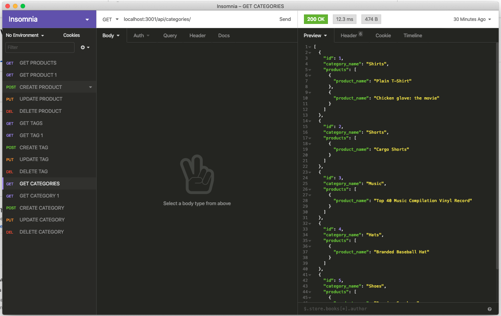

# E-commerce Back End 

[](https://www.youtube.com/watch?v=bGn8jjcgDXo&feature=youtu.be)

[Link to walkthrough video on YouTube](https://www.youtube.com/watch?v=bGn8jjcgDXo&feature=youtu.be)

## Description

Welcome to the E-commerce Back End project: A back end for an e-commerce website that uses the latest technologies so that a company can compete with other e-commerce companies. This application uses an Express.js API that's been made to use Sequelize to interact with a MySQL database.

## Usage

Clone or fork this repo if you would like. 

Install dependencies by running the following: 

```
npm i
```

You will need to create the schema from the MySQL shell by running the following command once you have signed into MySQL on the command line: 

```
source db/schema.sql
```

Then you will need to seed the database from the command line by typing the following:

```
npm run seed
```

Then you will need to start the application's server by typing the following on the command line:

```
npm start
```

## License

This application is covered under the MIT license.

## Contributing

Submit a pull request if you would like to contribute.

## Questions
Feel free to email me at seandoesitbetter@gmail.com with any questions.

Check out my GitHub profile: [seanc0ne](https://www.github.com/seanc0ne)
